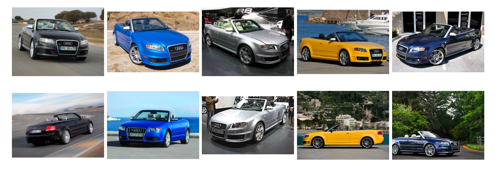

# Refined Stanford Cars Dataset

**Figure 1:** *Example images from the Stanford Cars [1] dataset. Showing cars from the same model which previously 
belong to the same class. After the refinement, each column correspond to an individual class.*

This repository contains a refined annotation file for the Stanford Cars [1] dataset. The refinement involved an enhancement 
of the class granularity. The original dataset contains 196 classes, where each class represents a car model. After the 
refinement, the dataset contains 1,600 classes, where each class represents a car model and a color (see Figure 1).

The refinement was done by using the color information of the cars. The color information was extracted with a ConvNeXt-B 
model. The model was initialized with pre-trained weights on the ImageNet-1k dataset and fine-tuned on the Vehicle Color
Recognition (VCoR) Dataset [2].

## I. Setup


## III. Data Preparation

### VCoR Dataset
In the process of fine-tuning the VCoR [2] dataset was used. The dataset contains around 10,500 images across 15 different
car color classes. The dataset was split into a training (7.5k images), validation (1.5k images) and test (1.5k images)
set. From the 15 classes only 10 classes were used for fine-tuning, the classes **beige**, **gold**, **pink**, **purple**, 
and **tan** were excluded. The excluded classes were not used because these colors were not primary hues associated with 
cars in the Stanford Cars [1] dataset. 
The VCoR dataset can be downloaded from [here](https://www.kaggle.com/datasets/landrykezebou/vcor-vehicle-color-recognition-dataset)
and should be placed in a `<data_dir>` directory. The directory structure should look like this:
```
<data_dir>
└───vcor-vehicle-color-recognition-dataset
    ├───test
    ├───train
    └───val
```

### Stanford Cars Dataset


## References
[1] Krause, Jonathan, et al. "3d object representations for fine-grained categorization." Proceedings of the IEEE 
International Conference on Computer Vision. 2013.

[2] Dincer, Berkay, and Cemal Köse. "Vehicle color recognition using deep learning." 2019 27th Signal Processing and 
Communications Applications Conference (SIU). IEEE, 2019.

